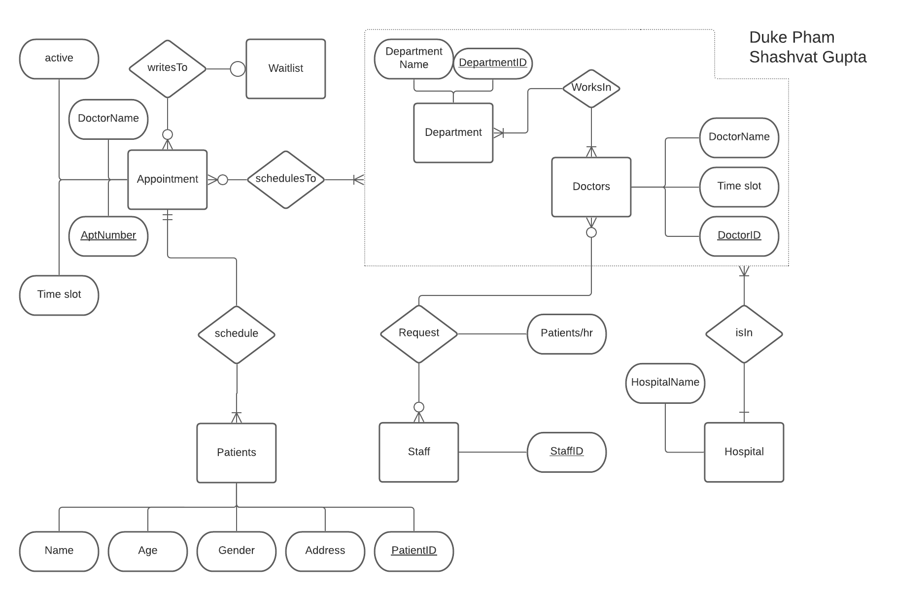
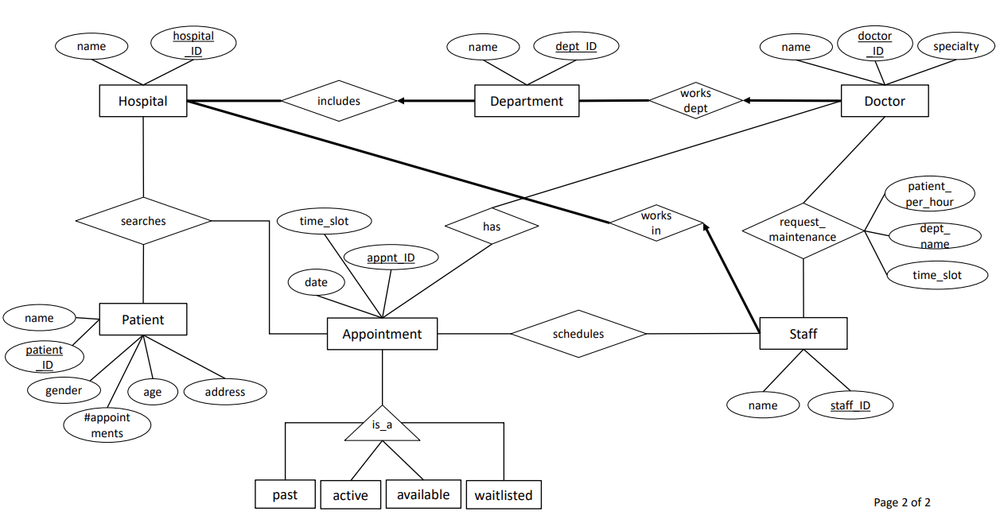

# Spring 2021 CS166 Final Project

## Group Members and Email:

* Duke Pham - dpham073@ucr.edu
* Shashvat Gupta - sgupt051@ucr.edu 

## Language/Tools/Technology:

* PostgreSQL(PSQL)
* Java
* Bash

## Purpose and Goal: 

* Create a hospital database management system that uses PSQL and Java to track information
* Information includes: record keeping of doctors and patients, setting up and managing appointments, maintenance of specialized departments.
 
## Hospital ERD schema proposal:

## Proposed Hospital ERD schema:

## Menu Functions : 

* Add Doctor
* Add Patient 
* Add Appointment 
* Make an Appoinment
* List appointments of a given doctor 
* List all available appoinments of a given department
* List total number of different types of appointments per doctor in descending order
* Find total number of patients per doctor with a given status

## Demonstration:

## Project Report Summary: 
