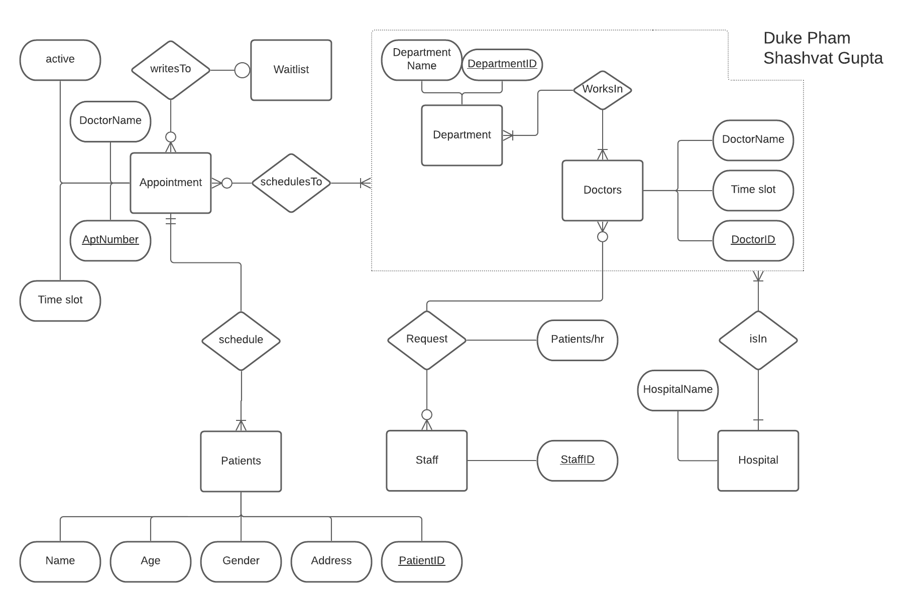

# Spring 2021 CS166 Final Project

## Group Members and Email:

* Duke Pham - dpham073@ucr.edu
* Shashvat Gupta - sgupt051@ucr.edu 

## Language/Tools/Technology:

* PostgreSQL(PSQL)
* Java
* Bash

## Purpose and Goal: 

* Create a hospital database management system that uses PSQL and Java to track information
* Database must have to: record keeping of doctors and patients, setting up and managing appointments, maintenance of specialized departments.

## Menu Functions must do the following: 

* Add Doctor
* Add Patient 
* Add Appointment 
* Make an Appoinment
* List appointments of a given doctor 
* List all available appoinments of a given department
* List total number of different types of appointments per doctor in descending order
* Find total number of patients per doctor with a given status

## Instructions on using the Hospital Database: 

* Open terminal 
* Navigate to "code" folder 
* Navigate to "postgresql" folder
* Run "startPostgreSQL.sh" using command "source ./startPostgre.sh"
* Run "createPostgreDB.sh" using command "source ./createPostgreDB.sh"
* Navigate to "java" folder
* Run "compile.sh" using command "source ./compile.sh"
* Run "run.sh" using command "source ./run.sh"
* Select menu number asking for inputs 
* Select 9 from menu to exit
 
## Proposed Hospital ERD schema:

## Actual Hospital ERD schema:

## Demonstration:

* Add doctor

* Add patient

* Add appointment

* Given a patient, a doctor and an appoinment of the doctor that s/he wants to take, add an appoinment to the DB

* For a doctor ID and a date range, find the list of active and available appointments of the doctor

* For a department name and a specific date, find the list of available appointments of the department

* Count number of different types of appointments per doctor and list them in descending order

* Find how many patients per doctor there are with a given status (i.e. PA, AC, AV, WL) and list that number per doctor.

